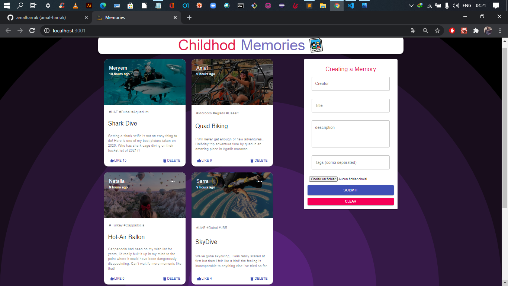

# Table of content

-   **[About](#about)**
-   **[Use It Locally](#use-it-locally)**
-   **[App Demo](#app-demo)**

<a name="about"></a>

# About

The App is called "Memories-App" and it is a simple social media app that allows users to:

-   post interesting events that happened in their lives
-   Like, update and remove a post

<a name="use-it-locally"></a>

# Use It Locally

```
    for both client and server-new side to start the app: 
    run npm i 
    npm start 
```
use folder: "server-new" like a server of app.


Go to: localhost:3000/

# App Demo


